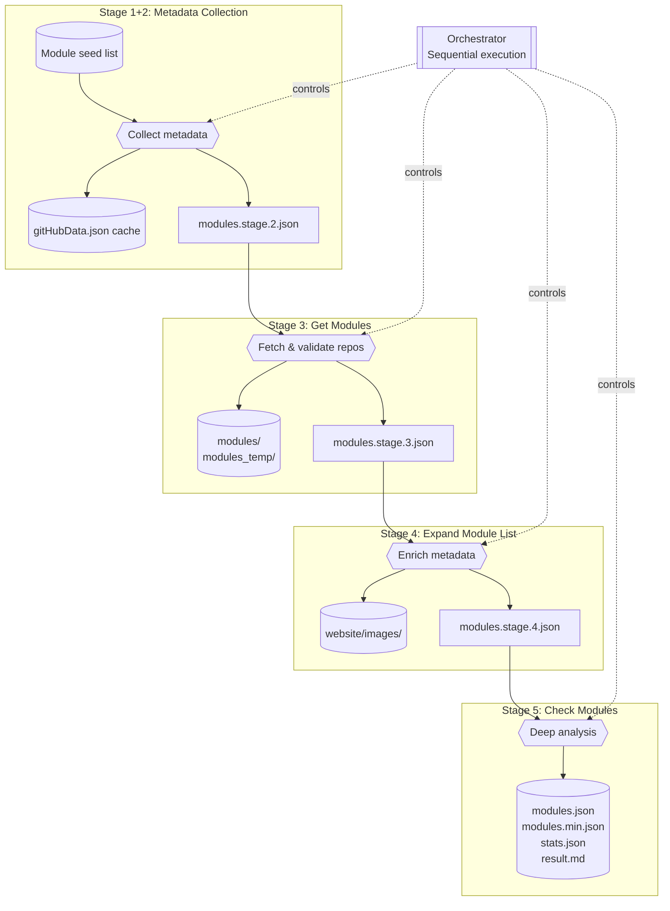
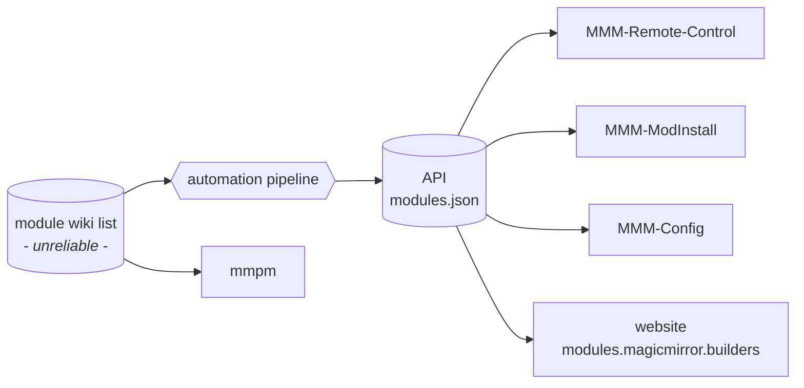
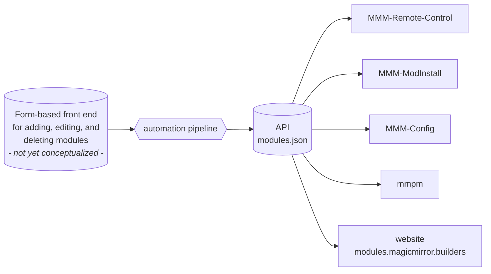
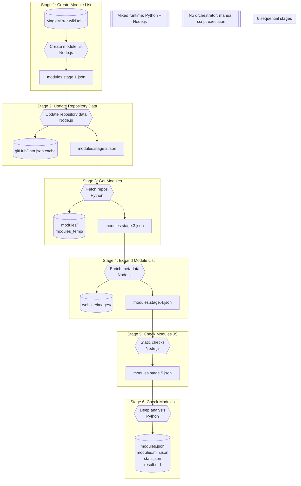
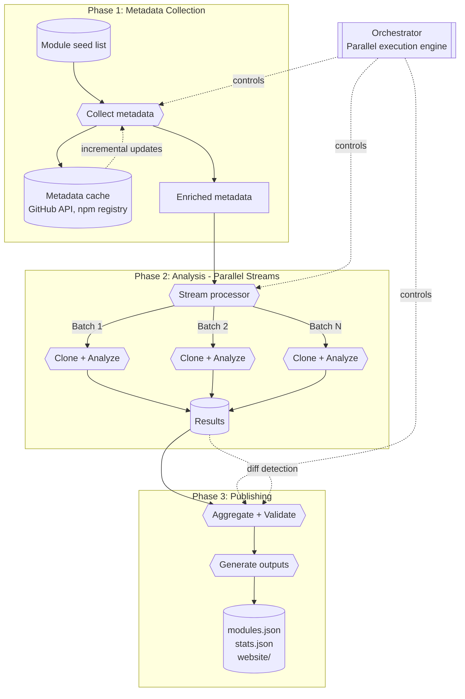
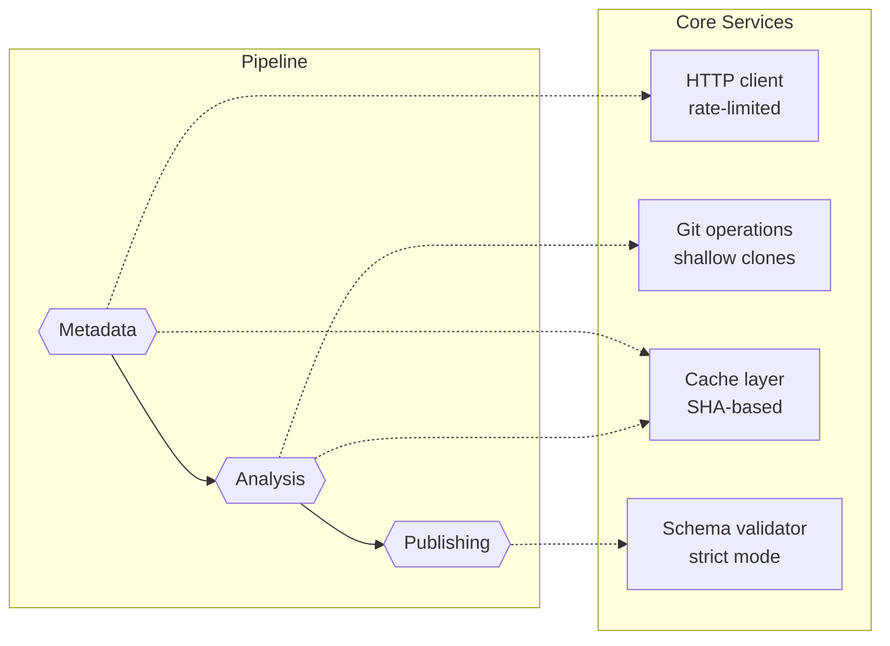

# Pipeline Architecture

Visibility into the automation that builds and publishes the third-party module catalogue helps contributors reason about changes and spot failure points early. This document summarizes the current pipeline, highlights the target architecture we are steering toward, and links each element back to the modernization roadmap.

## Current state (November 2025)

The production pipeline is orchestrated via `node scripts/orchestrator/index.js run full-refresh` (or the shorthand npm scripts) and progresses through five sequential stages. All stages are now implemented in TypeScript/Node.js and reuse the shared utility layer introduced in P2.1. Each stage produces a well-defined artifact that ships with a JSON Schema contract enforced at the boundary.

### Stage overview

| Order | Stage ID             | Runtime    | Key outputs                                                                                                  |
| ----- | -------------------- | ---------- | ------------------------------------------------------------------------------------------------------------ |
| 1+2   | `collect-metadata`   | Node.js    | `website/data/modules.stage.2.json`, `website/data/gitHubData.json`                                          |
| 3     | `get-modules`        | TypeScript | `website/data/modules.stage.3.json`, `modules/`, `modules_temp/`                                             |
| 4     | `expand-module-list` | Node.js    | `website/data/modules.stage.4.json`, `website/images/`                                                       |
| 5     | `check-modules`      | TypeScript | `website/data/modules.json`, `website/data/modules.min.json`, `website/data/stats.json`, `website/result.md` |

### Current workflow diagram

### Observations

- Stage contracts are codified via the bundled schemas stored under `dist/schemas/` (sources live in `pipeline/schemas/src/`).
- Cross-cutting utilities (HTTP, Git, filesystem, rate limiting) now live in `scripts/shared/` and are reused by every TypeScript stage, including the deep-analysis step.
- The orchestrator CLI runs the declarative stage graph and supports `--only/--skip`, retries, and shared logging.
- The comparison harness (`scripts/check-modules/compare/`) captures README/HTML alongside JSON outputs and applies warning thresholds before highlighting differences between runs.

### Distribution touchpoints

The diagrams below highlight the ecosystem entrypoints that feed the pipeline today and the target flow we are steering toward. They focus on the data producers/consumers around `https://modules.magicmirror.builders/data/modules.json` rather than the internal stages covered earlier in this document.

#### Current flow

#### Target flow

The target concept replaces the wiki table with a purpose-built, form-based frontend for adding, editing, and deleting modules (still in the conceptual phase) while downstream consumers continue using the unchanged API endpoint independent of the frontend.

### Legacy workflow snapshot (pre-September 2025)

This legacy diagram captures the pre-orchestrator, mixed-runtime pipeline that relied on direct node and Python scripts. The comparison with the current (5 stages, orchestrated, TypeScript migration underway) and target state (3 phases, parallel, streaming) shows the evolution of the architecture.

The roadmap contemplates a **simplified, streaming-first pipeline** that processes modules incrementally and in parallel where possible. This target architecture reduces the pipeline from 5 sequential stages to **3 conceptual phases** with intelligent caching and parallelization.

### Target workflow diagram

### Key architectural improvements

#### 1. **Three-phase pipeline** (down from 5 stages)

- **Phase 1: Metadata Collection** (combines current stages 1+2)
  - Fetch GitHub/npm metadata for all modules
  - Build enriched module list with repo info, package.json data
  - Single-pass operation with intelligent caching
- **Phase 2: Parallel Analysis** (combines current stages 3+4+5)
  - Process modules in **batches** (e.g., 50-100 modules per worker)
  - Each worker: clone → read package.json → capture screenshots → run checks
  - Workers run in parallel (configurable concurrency)
  - Incremental mode: **skip unchanged modules** based on git SHA comparison
- **Phase 3: Aggregation & Publishing** (new)
  - Collect results from all workers
  - Validate schema compliance
  - Generate final outputs (modules.json, stats.json, website)
  - Diff detection for change reporting

#### 2. **Streaming & batching**

Instead of loading all 1300+ modules into memory:

- **Stream-based processing**: Read seed list → process in chunks → write incrementally
- **Configurable batch size**: Tune based on available memory
- **Graceful degradation**: If one batch fails, others continue
- **Progress tracking**: Clear visibility into which modules are being processed

#### 3. **Intelligent caching & incremental updates**

- **Module-level cache**: Store analysis results per module, keyed by git SHA
- **Skip unchanged modules**: If repo SHA hasn't changed since last run, reuse cached results
- **Metadata cache**: GitHub API responses and npm registry data cached with TTL
- **Partial refresh mode**: `--modules=<pattern>` to reprocess only specific modules

#### 4. **Parallel execution**

- **Worker pool architecture**: Configurable number of parallel workers
- **Phase 1 can start Phase 2 early**: Stream metadata as it arrives
- **Independent workers**: No shared state, communicate via message passing
- **Resource limiting**: Respect GitHub rate limits, memory constraints

#### 5. **Simplified dependencies**

### Advantages over legacy architecture

| Legacy (6 stages, sequential)     | Target (3 phases, parallel)                 |
| --------------------------------- | ------------------------------------------- |
| Mixed runtime (Python + Node.js)  | Unified TypeScript codebase                 |
| Process all modules sequentially  | Process modules in parallel batches         |
| Reload full dataset at each stage | Stream data through pipeline                |
| No incremental updates            | Skip unchanged modules automatically        |
| OOM risk with 1300+ modules       | Bounded memory per batch                    |
| ~45-60 min full run               | ~15-20 min with caching, <5 min incremental |
| Difficult to debug stuck modules  | Per-module isolation and logging            |
| 6 intermediate JSON files         | 1 enriched metadata + final outputs         |

### Migration path

The path from the current 5-stage architecture to the target 3-phase streaming architecture is detailed in the [Pipeline Modernization Roadmap](pipeline-refactor-roadmap.md), organized into two major milestones:

- **Milestone 1** (P3.x-P4.x): Build foundations with incremental checking, batch processing, and module-level caching
- **Milestone 2** (P5.x-P8.x): Transform to 3-phase streaming architecture with parallel workers and intelligent orchestration

See [pipeline-refactor-roadmap.md](pipeline-refactor-roadmap.md) for the complete breakdown of tasks, dependencies, and priorities.

## How this document stays fresh

- Update the diagrams whenever the stage graph (`pipeline/stage-graph.json`) or comparison harness outputs change.
- Fold in structured logging timelines, diff gating, and other resiliency milestones (tasks **P3.3** and beyond) as they land.
- Cross-link to companion docs (`pipeline/check-modules-reference.md`, `pipeline-refactor-roadmap.md`) whenever new guardrails or fixtures ship, so contributors can trace updates end to end.
