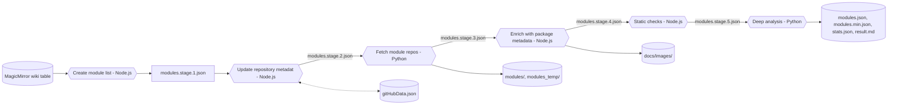
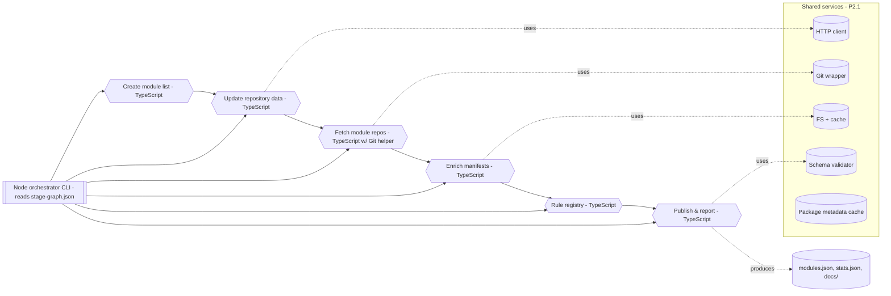

# Pipeline Architecture

Visibility into the automation that builds and publishes the third-party module catalogue helps contributors reason about changes and spot failure points early. This document summarizes the current pipeline, highlights the target architecture we are steering toward, and links each element back to the modernization roadmap.

## Current state (September 2025)

The production pipeline is triggered manually via `node --run all` and progresses through six sequential stages. Two stages are implemented in Python and run subprocesses such as `git`, `npm`, and `npm-check-updates`; the rest are Node.js scripts. Each stage produces a well-defined artifact that now ships with a JSON Schema contract.

### Stage overview

| Order | Stage ID                 | Runtime | Key outputs                                                                                      |
| ----- | ------------------------ | ------- | ------------------------------------------------------------------------------------------------ |
| 1     | `create-module-list`     | Node.js | `docs/data/modules.stage.1.json`                                                                 |
| 2     | `update-repository-data` | Node.js | `docs/data/modules.stage.2.json`, `docs/data/gitHubData.json`                                    |
| 3     | `get-modules`            | Python  | `docs/data/modules.stage.3.json`, `modules/`, `modules_temp/`                                    |
| 4     | `expand-module-list`     | Node.js | `docs/data/modules.stage.4.json`, `docs/images/`                                                 |
| 5     | `check-modules-js`       | Node.js | `docs/data/modules.stage.5.json`                                                                 |
| 6     | `check-modules`          | Python  | `docs/data/modules.json`, `docs/data/modules.min.json`, `docs/data/stats.json`, `docs/result.md` |

### Current workflow diagram

### Observations

- Stage contracts are codified via the schemas stored under `pipeline/schemas/`.
- Cross-cutting utilities (HTTP, Git, filesystem) are still duplicated between Python and Node scripts.
- The orchestration logic lives in ad-hoc npm scripts, making it hard to express partial runs or retries.

## Target state

The roadmap contemplates a TypeScript-first pipeline driven by a declarative stage graph. The near-term target introduces a dedicated orchestrator (task **P1.2**) that reads `pipeline/stage-graph.json`, executes stages with structured logging, and exposes `--only`/`--skip` flags. Subsequent work ports Python stages to TypeScript (tasks **P2.2** and **P2.3**) and centralizes shared utilities (**P2.1**).

### Target workflow diagram

### Advantages we unlock

- **Unified runtime**: A single TypeScript codebase simplifies dependency management and testing (tasks **P2.1–P2.4**).
- **Explicit orchestration**: The CLI understands dependencies, making parallelism, retries, and partial runs possible (task **P1.2**).
- **Reusable schema definitions**: Shared `$defs` keep stage contracts and final outputs aligned (task **P1.6**).
- **Faster iteration**: With shared services and fixtures, regression tests can run on curated datasets (task **P4.3**).

## How this document stays fresh

- Update the diagrams whenever the stage graph (`pipeline/stage-graph.json`) changes.
- Add timing metrics and optional branches once structured logging (task **P3.3**) lands.
- When the TypeScript orchestrator ships, replace the “Target state” diagram with the actual implementation details and mark the roadmap tasks as complete.
