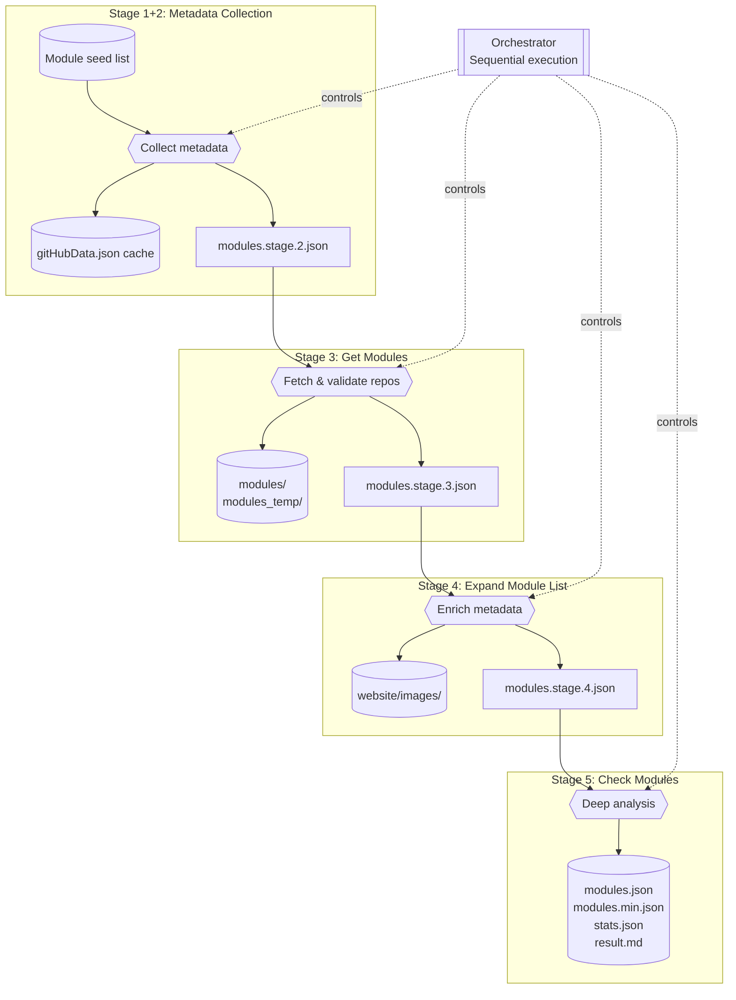
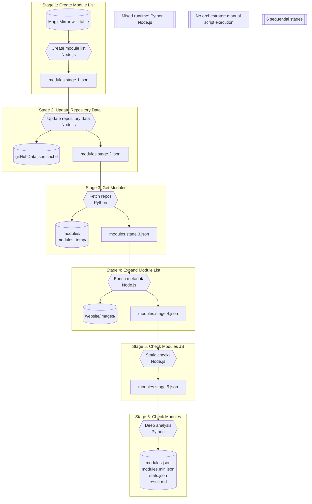
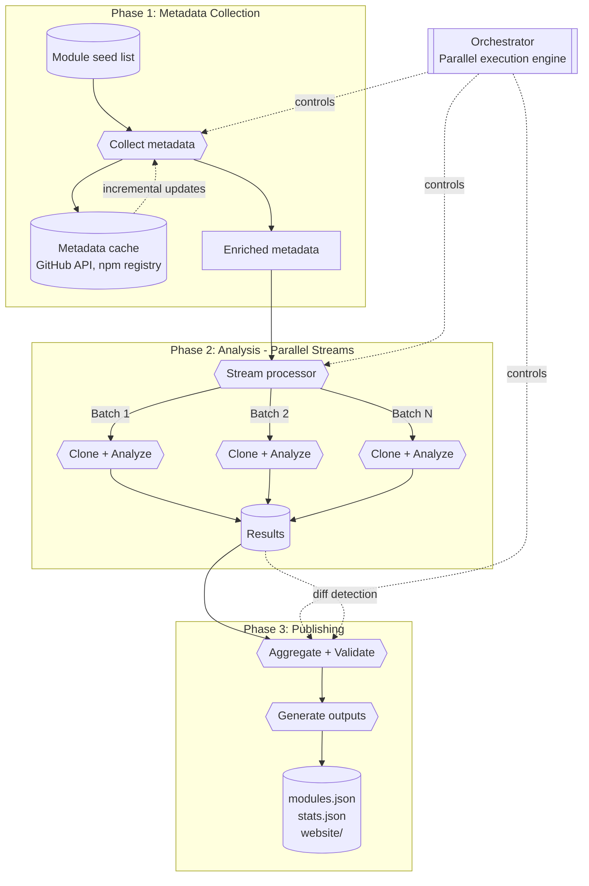
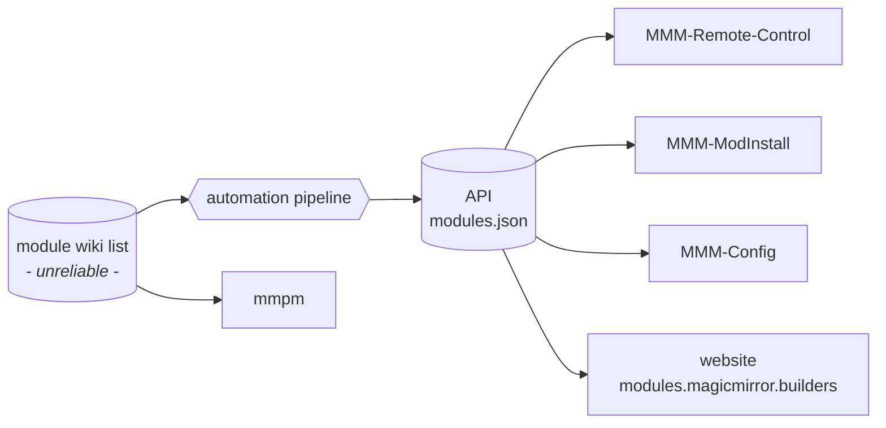
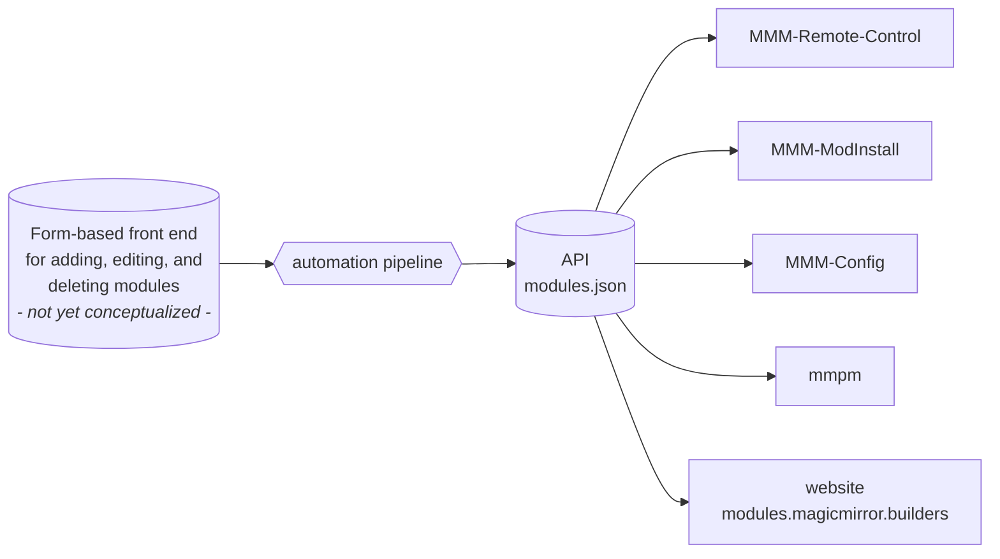

# Pipeline Architecture

Visibility into the automation that builds and publishes the third-party module catalogue helps contributors reason about changes and spot failure points early. This document summarizes the current pipeline, the legacy state we migrated from, and the target architecture we are steering toward.

## Current State (January 2026)

The production pipeline is orchestrated via `node scripts/orchestrator/index.js run full-refresh` and progresses through five sequential stages. All stages are implemented in TypeScript/Node.js with unified tooling, JSON Schema contracts at every boundary, and intelligent caching throughout.

### Stage Overview

| Order | Stage ID             | Key Outputs                                                   |
| ----- | -------------------- | ------------------------------------------------------------- |
| 1+2   | `collect-metadata`   | `modules.stage.2.json`, `gitHubData.json`                     |
| 3     | `get-modules`        | `modules.stage.3.json`, `modules/`, `modules_temp/`           |
| 4     | `expand-module-list` | `modules.stage.4.json`, `website/images/`                     |
| 5     | `check-modules`      | `modules.json`, `modules.min.json`, `stats.json`, `result.md` |

### Current Workflow Diagram

### Key Features

- **Orchestrator CLI**: Declarative stage graph with `--only/--skip` support, retries, and structured logging
- **Schema Validation**: JSON schemas enforce contracts at every stage boundary (`dist/schemas/`)
- **Shared Utilities**: HTTP, Git, filesystem, and rate limiting in `scripts/shared/`
- **Comparison Harness**: Captures README/HTML alongside JSON for regression testing

### Incremental Pipeline Behavior

The pipeline implements intelligent caching and skip logic to avoid redundant work:

| Stage | Optimization   | Skip Condition                  | Typical Gain         |
| ----- | -------------- | ------------------------------- | -------------------- |
| 2     | Cache pruning  | Module removed from seed list   | Bounded cache size   |
| 2     | API cache TTL  | Response < 7 days old           | ~95% fewer API calls |
| 3     | Clone skipping | Local commit ≥ API `lastCommit` | ~90% clones skipped  |
| 5     | Analysis cache | Directory SHA unchanged         | ~85-95% cache hits   |

**Result**: Incremental runs complete in <5 minutes vs. 45-60 minutes for full runs.

---

## Legacy Workflow Snapshot (pre-September 2025)

This legacy diagram captures the pre-orchestrator, mixed-runtime pipeline. Key issues that motivated the modernization:

- Mixed Python + Node.js runtime made maintenance difficult
- No orchestrator: manual script execution
- No incremental updates: full run required every time
- OOM risk with 1300+ modules loaded into memory
- 6 sequential stages with 6 intermediate JSON files

---

## Target Architecture (3-Phase Streaming)

The target architecture reduces the pipeline from 5 sequential stages to **3 conceptual phases** with parallel execution and streaming:

### Target Workflow Diagram

### Comparison: Legacy vs. Current vs. Target

| Aspect             | Legacy (6 stages) | Current (5 stages)      | Target (3 phases)    |
| ------------------ | ----------------- | ----------------------- | -------------------- |
| Runtime            | Python + Node.js  | TypeScript/Node.js      | TypeScript           |
| Execution          | Sequential        | Sequential + caching    | Parallel + streaming |
| Incremental        | ❌ No             | ✅ Yes (~90% skip rate) | ✅ Yes + workers     |
| Memory             | Unbounded         | Batch-bounded           | Per-worker bounded   |
| Full run time      | ~45-60 min        | ~15-20 min              | ~10-15 min           |
| Incremental time   | N/A               | <5 min                  | <3 min               |
| Intermediate files | 6                 | 4                       | 1 + final            |

### Target Architecture Benefits

1. **Three-phase pipeline** consolidates current stages (1+2 → Phase 1, 3+4+5 → Phase 2, new → Phase 3)
2. **Parallel workers** process modules in batches concurrently
3. **Streaming** eliminates need to load all modules into memory
4. **Diff detection** in aggregation phase for change reporting

---

## Distribution Touchpoints

### Current Flow

### Target Flow

The target replaces the wiki with a form-based frontend while downstream consumers continue using the unchanged API endpoint.

---

## Related Documentation

- [Pipeline Modernization Roadmap](pipeline-refactor-roadmap.md) — Task breakdown and priorities
- [Deterministic Outputs](deterministic-outputs.md) — Guarantees for reproducible builds
- [Check Modules Reference](pipeline/check-modules-reference.md) — Rule registry and fixtures
- [CONTRIBUTING.md](CONTRIBUTING.md) — Setup instructions and workflow tips
