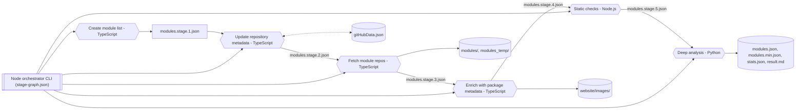
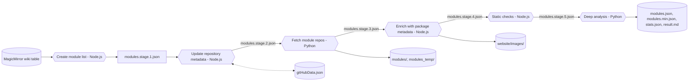

# Pipeline Architecture

Visibility into the automation that builds and publishes the third-party module catalogue helps contributors reason about changes and spot failure points early. This document summarizes the current pipeline, highlights the target architecture we are steering toward, and links each element back to the modernization roadmap.

## Current state (September 2025)

The production pipeline is orchestrated via `node scripts/orchestrator/index.js run full-refresh` (or the shorthand npm scripts) and progresses through six sequential stages. Most stages are implemented in TypeScript/Node.js and reuse the shared utility layer introduced in P2.1; the final deep-analysis stage remains Python for now. Each stage produces a well-defined artifact that ships with a JSON Schema contract enforced at the boundary.

### Stage overview

| Order | Stage ID                 | Runtime    | Key outputs                                                                                                  |
| ----- | ------------------------ | ---------- | ------------------------------------------------------------------------------------------------------------ |
| 1     | `create-module-list`     | Node.js    | `website/data/modules.stage.1.json`                                                                          |
| 2     | `update-repository-data` | Node.js    | `website/data/modules.stage.2.json`, `website/data/gitHubData.json`                                          |
| 3     | `get-modules`            | TypeScript | `website/data/modules.stage.3.json`, `modules/`, `modules_temp/`                                             |
| 4     | `expand-module-list`     | Node.js    | `website/data/modules.stage.4.json`, `website/images/`                                                       |
| 5     | `check-modules-js`       | Node.js    | `website/data/modules.stage.5.json`                                                                          |
| 6     | `check-modules`          | Python     | `website/data/modules.json`, `website/data/modules.min.json`, `website/data/stats.json`, `website/result.md` |

### Current workflow diagram

### Observations

- Stage contracts are codified via the bundled schemas stored under `dist/schemas/` (sources live in `pipeline/schemas/src/`).
- Cross-cutting utilities (HTTP, Git, filesystem, rate limiting) now live in `scripts/shared/` and are reused by the TypeScript stages.
- The orchestrator CLI runs the declarative stage graph and supports `--only/--skip`, retries, and shared logging.

### Legacy workflow snapshot (pre-September 2025)

This legacy diagram captures the pre-orchestrator, mixed-runtime pipeline that relied on direct node and Python scripts. Retaining it here provides a historical comparison as we continue to modernize the remaining stages.

## Target state

The roadmap contemplates a TypeScript-first pipeline driven by a declarative stage graph. The near-term target introduces a dedicated orchestrator (task **P1.2**) that reads `pipeline/stage-graph.json`, executes stages with structured logging, and exposes `--only`/`--skip` flags. Usage details live in the [orchestrator CLI reference](pipeline/orchestrator-cli-reference.md). Subsequent work ports Python stages to TypeScript (tasks **P2.2** and **P2.3**) and centralizes shared utilities (**P2.1**).

### Target workflow diagram

### Advantages we unlock

- **Unified runtime**: A single TypeScript codebase simplifies dependency management and testing (tasks **P2.1–P2.4**).
- **Explicit orchestration**: The CLI understands dependencies, making parallelism, retries, and partial runs possible (task **P1.2**).
- **Reusable schema definitions**: Shared `$defs` keep stage contracts and final outputs aligned (task **P1.6**).
- **Faster iteration**: With shared services and fixtures, regression tests can run on curated datasets (task **P4.3**).

## How this document stays fresh

- Update the diagrams whenever the stage graph (`pipeline/stage-graph.json`) changes.
- Add timing metrics and optional branches once structured logging (task **P3.3**) lands.
- When the TypeScript orchestrator ships, replace the “Target state” diagram with the actual implementation details and mark the roadmap tasks as complete.
