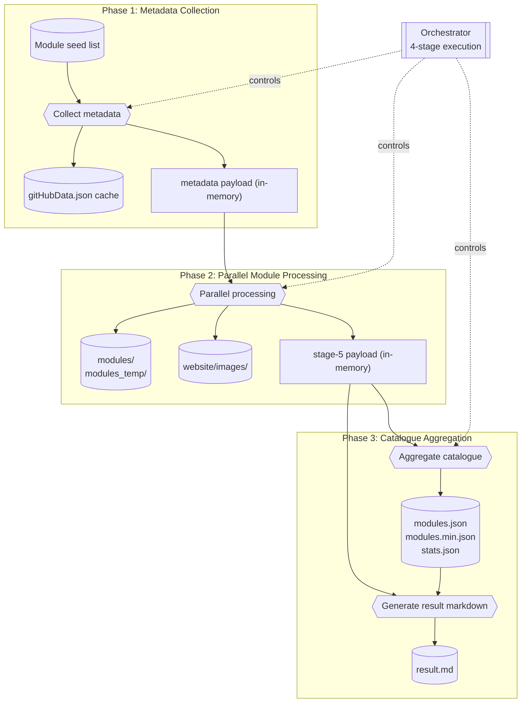
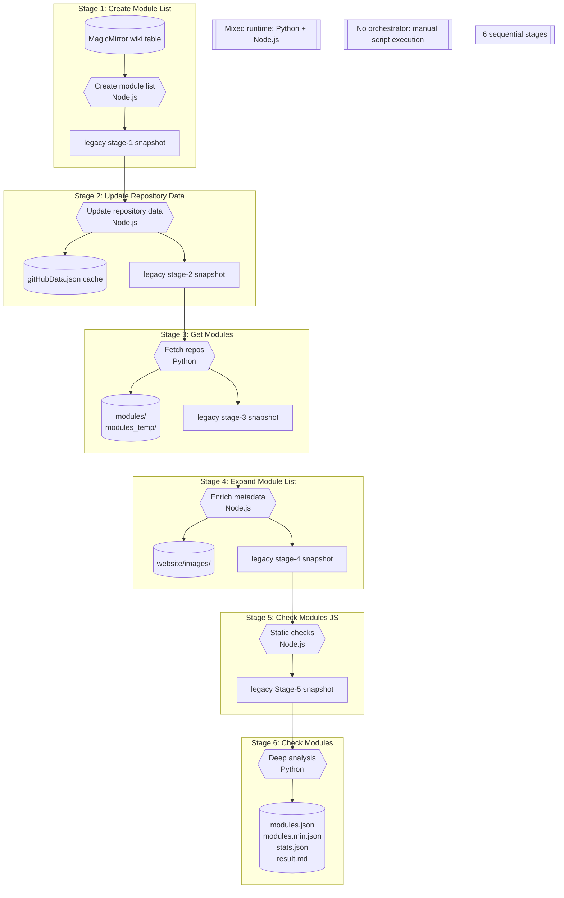
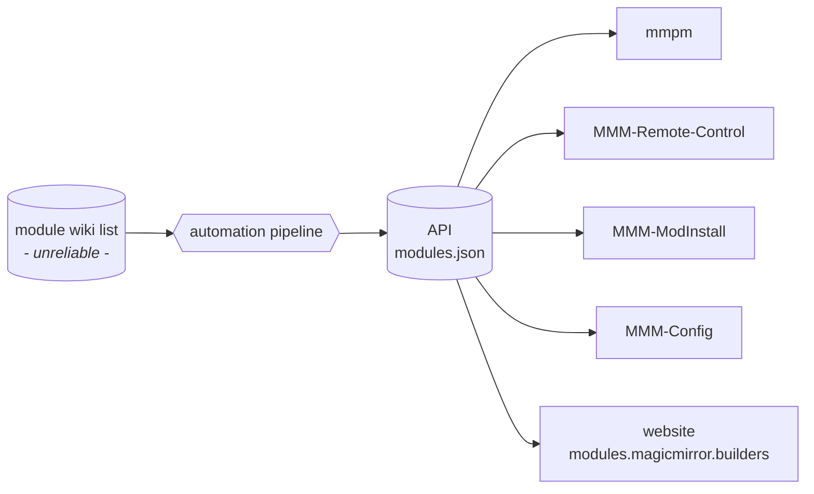
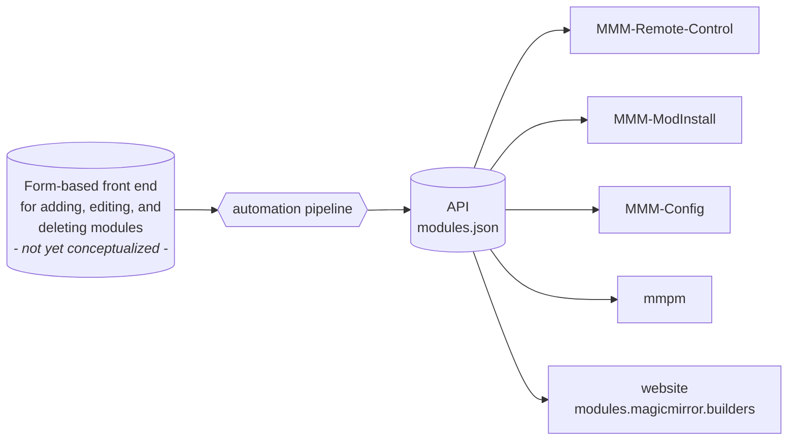

# Pipeline Architecture

Visibility into the automation that builds and publishes the third-party module catalogue helps contributors reason about changes and spot failure points early. This document summarizes the current canonical pipeline, the legacy state we migrated from, and the parts of the broader architecture that are still future-facing.

## Current State (March 2026)

The supported production pipeline is orchestrated via `node scripts/orchestrator/index.ts run full-refresh-parallel` (also exposed as `node --run all`). The orchestrator now drives four registered stages across three operational phases: metadata collection, parallel module processing, and publication.

### Stage Overview

| Order | Stage ID                   | Key Outputs                                                               |
| ----- | -------------------------- | ------------------------------------------------------------------------- |
| 1     | `collect-metadata`         | in-memory metadata payload, `gitHubData.json`                             |
| 2     | `parallel-processing`      | in-memory stage-5 payload, `modules/`, `modules_temp/`, `website/images/` |
| 3     | `aggregate-catalogue`      | `modules.json`, `modules.min.json`, `stats.json`                          |
| 4     | `generate-result-markdown` | `result.md`                                                               |

### Current Workflow Diagram

```mermaid
flowchart TB
  orchestrator[[Orchestrator<br>4-stage execution]]

  subgraph Phase 1: Metadata Collection
    seed[("Module seed list")] --> collect{{Collect metadata}}
    collect --> cache[("gitHubData.json cache")]
    collect --> metadata["metadata payload (in-memory)"]
  end

  subgraph Phase 2: Parallel Module Processing
    metadata --> parallel{{Parallel processing}}
    parallel --> clones[("modules/<br>modules_temp/")]
    parallel --> images[("website/images/")]
    parallel --> stage5["stage-5 payload (in-memory)"]
  end

  subgraph Phase 3: Catalogue Aggregation
    stage5 --> aggregate{{Aggregate catalogue}}
    aggregate --> outputs[("modules.json<br>modules.min.json<br>stats.json")]
    stage5 --> result{{Generate result markdown}}
    outputs --> result
    result --> resultMd[("result.md")]
  end

  orchestrator -.controls.-> collect
  orchestrator -.controls.-> parallel
  orchestrator -.controls.-> aggregate
```

### Key Features

- **Orchestrator CLI**: Declarative stage graph with `--only/--skip` support, retries, and structured logging
- **Worker Pool Stage**: `parallel-processing` encapsulates clone, enrich, image, and analysis work behind a single supported stage
- **Aggregation Stage**: `aggregate-catalogue` builds published JSON artifacts from the in-memory stage-5 payload
- **Schema Validation**: JSON schemas enforce contracts at the published boundaries (`modules.json`, `modules.min.json`, `stats.json`)
- **Shared Utilities**: HTTP, Git, filesystem, and rate limiting in `scripts/shared/`

### Incremental Pipeline Behavior

The pipeline implements intelligent caching and skip logic to avoid redundant work:

| Scope             | Optimization     | Current Behavior                                                                           | Why It Helps                                                         |
| ----------------- | ---------------- | ------------------------------------------------------------------------------------------ | -------------------------------------------------------------------- |
| Metadata          | API cache TTL    | Reuses recent host API responses during `collect-metadata`                                 | Reduces external API traffic                                         |
| Module processing | Clone reuse      | Recycles `modules_temp/` when repositories can be refreshed in place                       | Avoids unnecessary full re-clones                                    |
| Module processing | Worker batching  | Processes modules in bounded child-process batches                                         | Keeps memory bounded and throughput predictable                      |
| Analysis cache    | Cache read/write | Worker-compatible `moduleCache.json` drives skip/read/write/prune in `parallel-processing` | Restores second-run skip behavior while preserving worker throughput |

---

## Legacy Workflow Snapshot (pre-September 2025)

```mermaid
flowchart TB
  subgraph Stage 1: Create Module List
    wiki[("MagicMirror wiki table")] --> createLegacy{{Create module list<br>Node.js}}
    createLegacy --> stage1Legacy["legacy stage-1 snapshot"]
  end

  subgraph Stage 2: Update Repository Data
    stage1Legacy --> updateLegacy{{Update repository data<br>Node.js}}
    updateLegacy --> cacheLegacy[("gitHubData.json cache")]
    updateLegacy --> stage2Legacy["legacy stage-2 snapshot"]
  end

  subgraph Stage 3: Get Modules
    stage2Legacy --> getLegacy{{Fetch repos<br>Python}}
    getLegacy --> clonesLegacy[("modules/<br>modules_temp/")]
    getLegacy --> stage3Legacy["legacy stage-3 snapshot"]
  end

  subgraph Stage 4: Expand Module List
    stage3Legacy --> expandLegacy{{Enrich metadata<br>Node.js}}
    expandLegacy --> imagesLegacy[("website/images/")]
    expandLegacy --> stage4Legacy["legacy stage-4 snapshot"]
  end

  subgraph Stage 5: Check Modules JS
    stage4Legacy --> checkjsLegacy{{Static checks<br>Node.js}}
    checkjsLegacy --> stage5Legacy["legacy Stage-5 snapshot"]
  end

  subgraph Stage 6: Check Modules
    stage5Legacy --> checkLegacy{{Deep analysis<br>Python}}
    checkLegacy --> outputsLegacy[("modules.json<br>modules.min.json<br>stats.json<br>result.md")]
  end

  note1[["Mixed runtime: Python + Node.js"]]
  note2[["No orchestrator: manual script execution"]]
  note3[["6 sequential stages"]]
```

This legacy diagram captures the pre-orchestrator, mixed-runtime pipeline. Key issues that motivated the modernization:

- Mixed Python + Node.js runtime made maintenance difficult
- No orchestrator: manual script execution
- No incremental updates: full run required every time
- OOM risk with 1300+ modules loaded into memory
- 6 sequential stages with 6 intermediate JSON files

### Comparison: Legacy vs. Current Flow

| Aspect             | Legacy (6 stages)         | Current flow (Mar 2026)                                                                                  |
| ------------------ | ------------------------- | -------------------------------------------------------------------------------------------------------- |
| Runtime            | Python + Node.js          | Node.js with TypeScript-based deep checks                                                                |
| Execution          | Sequential manual scripts | Orchestrated 4-stage pipeline with in-process handoff                                                    |
| Incremental        | ❌ No                     | Partial: metadata cache + clone reuse                                                                    |
| Memory             | Unbounded                 | Batch-/worker-bounded                                                                                    |
| Intermediate files | 6                         | none; only published outputs are written (`modules.json`, `modules.min.json`, `stats.json`, `result.md`) |

### Remaining Gaps

1. Reintegrate worker-compatible `moduleCache.json` handling under P7.6.
2. Record before/after repeated-run performance metrics once cache writes are back in place.
3. Keep the published contract (`modules.json`, `modules.min.json`, `stats.json`, `result.md`) stable while worker caching evolves.

No persisted intermediate stage boundary remains. Stage handoffs are fully in-memory.

---

## Distribution Touchpoints

This section is about how module data enters the system and reaches downstream consumers. Unlike the canonical pipeline above, part of this flow is still conceptual.

### Current Intake Flow

```mermaid
flowchart LR
  wiki[(module wiki list<br><i>- unreliable -</i>)]
  pipeline{{automation pipeline}}
  api[(API<br>modules.json)]
  remote[MMM-Remote-Control]
  modinstall[MMM-ModInstall]
  config[MMM-Config]
  mmpm[mmpm]
  moduleWebsite[website<br>modules.magicmirror.builders]

  wiki --> pipeline --> api
  api --> mmpm
  api --> remote
  api --> modinstall
  api --> config
  api --> moduleWebsite
```

### Potential Future Intake Flow

```mermaid
flowchart LR
  ui[(Form-based front end<br>for adding, editing, and<br>deleting modules<br><i>- not yet conceptualized -</i>)]
  pipeline{{automation pipeline}}
  api[(API<br>modules.json)]
  remote[MMM-Remote-Control]
  modinstall[MMM-ModInstall]
  config[MMM-Config]
  mmpm[mmpm]
  moduleWebsite[website<br>modules.magicmirror.builders]

  ui --> pipeline --> api
  api --> remote
  api --> modinstall
  api --> config
  api --> mmpm
  api --> moduleWebsite
```

If this direction is pursued, the wiki would be replaced with a form-based frontend while downstream consumers continue using the unchanged API endpoint.

---

## Related Documentation

- [Deterministic Outputs](deterministic-outputs.md) — Guarantees for reproducible builds
- [Check Modules Reference](pipeline/check-modules-reference.md) — Rule registry and fixtures
- [CONTRIBUTING.md](CONTRIBUTING.md) — Setup instructions and workflow tips
