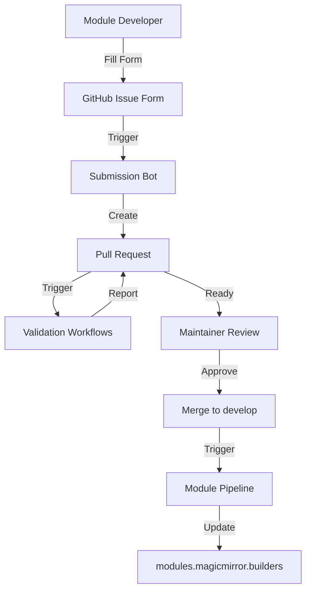

# Module Submission System - Complete Guide

## 📋 Table of Contents

- [Overview](#overview)
- [Architecture](#architecture)
- [User Workflows](#user-workflows)
- [Maintainer Guide](#maintainer-guide)
- [Trusted User System](#trusted-user-system)
- [Testing & Rollout Plan](#testing--rollout-plan)
- [Migration Strategy](#migration-strategy)

## Overview

This system replaces the wiki-based module list with a modern, automated submission workflow using GitHub Pull Requests, Issue Forms, and automated validation.

### Key Benefits

| Stakeholder           | Benefits                                                                |
| --------------------- | ----------------------------------------------------------------------- |
| **Module Developers** | Easy web form OR direct PR, instant validation feedback                 |
| **Maintainers**       | Automated quality checks, no manual syntax fixing, clear review process |
| **Users**             | Higher quality list, fewer broken links, better metadata                |
| **Project**           | Version control, contribution tracking, modern CI/CD                    |

## Architecture

### Component Overview



### File Structure

```text
.github/
  ISSUE_TEMPLATE/
    module-submission.yml           # Web form for submissions
  workflows/
    module-submission-bot.yml       # Issue → PR automation
    validate-module-submission.yml  # PR validation checks

module-submissions/
  pending/                          # New submissions
    MMM-Example.json
  approved/                         # Approved modules
    modules-registry.json           # Master list
  module-submission.schema.json     # Validation schema
  README.md

scripts/
  module-submission/
    validate.js                     # Schema validation
    check-duplicates.js             # Duplicate detection
    check-repository.js             # Repo accessibility checks
    quality-check.js                # Quality metrics
```

## User Workflows

### Workflow 1: Web Form Submission (Recommended for Most Users)

**Perfect for:** Module developers who want the simplest experience

1. **Navigate to submission form:**
   - Go to https://github.com/MagicMirrorOrg/MagicMirror-3rd-Party-Modules/issues/new/choose
   - Click "Submit a MagicMirror² Module"

2. **Fill out the form:**
   - Repository URL (required)
   - Module name (required)
   - Description (required)
   - Category (required)
   - Submission type (New/Update)
   - Additional information (optional)

3. **Submit & wait:**
   - Bot creates PR automatically
   - Validation runs within minutes
   - Check PR for validation results
   - Respond to maintainer feedback if needed

4. **Module goes live:**
   - Once approved and merged
   - Website updates within 24 hours

### Workflow 2: Direct Pull Request (Advanced Users)

**Perfect for:** Developers comfortable with Git/GitHub, batch submissions

1. **Fork the repository**

2. **Create submission file:**

   ```bash
   cd module-submissions/pending/
   cat > MMM-YourModule.json << 'EOF'
   {
     "url": "https://github.com/username/MMM-YourModule",
     "name": "MMM-YourModule",
     "description": "Your module description here",
     "category": "Weather",
     "submissionType": "New Module",
     "additionalInfo": "",
     "submittedBy": "your-github-username",
     "submittedAt": "2025-10-19T12:00:00Z",
     "issueNumber": 0
   }
   EOF
   ```

3. **Validate locally (optional but recommended):**

   ```bash
   export CHANGED_FILES="module-submissions/pending/MMM-YourModule.json"
   npm run submission:validate
   ```

4. **Open Pull Request:**
   - Target branch: `develop`
   - Title: `[Module Submission] MMM-YourModule`
   - Wait for automated validation

5. **Respond to feedback:**
   - Fix any issues
   - Push updates to same branch
   - Re-validation runs automatically

## Maintainer Guide

### Daily Review Process

1. **Check for new PRs:**
   - Filter by label: `module-submission`
   - Look for label: `validation-passed` (ready to review)

2. **Review automated validation report:**
   - Check bot comment on PR
   - All ✅ = good to go
   - Any ❌ = request changes from submitter

3. **Manual review (quick check):**
   - Does description make sense?
   - Is category appropriate?
   - No obvious spam/malicious content?

4. **Approve & merge:**
   - Add approval review
   - Merge to `develop`
   - Module appears on website next pipeline run

### Handling Problematic Submissions

**Duplicate submission:**

- Bot will flag it automatically
- Comment: "This module is already listed at {URL}"
- Close PR with explanation

**Invalid repository:**

- Bot will flag missing files
- Request submitter to add required files
- Re-validation happens automatically on update

**Spam/malicious:**

- Close immediately
- Add label `spam`
- Block user if repeated offense

**Update to existing module:**

- Verify submitter is module author or has permission
- Check what metadata is changing
- Approve if legitimate update

### Managing Trusted Contributors

**Criteria for trusted status:**

- 3+ successful module submissions
- No rejected PRs in last 6 months
- Module has >50 stars OR maintainer recommendation

**Adding a trusted user:**

```bash
# Add to GitHub team
gh api orgs/MagicMirrorOrg/teams/trusted-contributors/memberships/username -X PUT
```

**Revoking trusted status:**

- Remove from GitHub team
- Future PRs require manual approval again

## Trusted User System

### Simple Manual Management

**Philosophy:** Maintainers manually grant trusted status to reliable contributors. No automatic criteria or complex logic.

### Implementation: GitHub Teams

```text
MagicMirrorOrg/
  teams/
    maintainers/              # Full admin rights (you and core team)
    trusted-contributors/     # Auto-approval eligible (manually curated)
```

**How it works:**

1. Maintainer adds user to `trusted-contributors` team (via web UI or CLI)
2. User's future PRs get auto-approved after validation passes
3. Maintainer can remove users from team if needed

### Adding a Trusted User

**Via GitHub Web UI:**

```text
1. Navigate to: https://github.com/orgs/MagicMirrorOrg/teams/trusted-contributors
2. Click "Add a member"
3. Enter username
4. Done!
```

**Via GitHub CLI:**

```bash
# Add user to trusted contributors
gh api orgs/MagicMirrorOrg/teams/trusted-contributors/memberships/username -X PUT

# Remove user
gh api orgs/MagicMirrorOrg/teams/trusted-contributors/memberships/username -X DELETE

# List current members
gh api orgs/MagicMirrorOrg/teams/trusted-contributors/members
```

### When to Grant Trusted Status?

**Suggested guidelines (not rules):**

- User has successfully submitted 2-3 quality modules
- Modules are well-maintained and documented
- User understands submission requirements
- Active, trustworthy community member

**But:** You decide! Use your judgment as a maintainer.

### Benefits for Trusted Users

- ⚡ **Auto-approval** after validation passes
- 🚀 **Faster merge** (no waiting for manual review)
- 🏆 **Recognition** via `trusted-contributor` label
- ✨ **Shows appreciation** for their contributions

### Workflow Integration

The validation workflow automatically:

1. Checks if PR author is in `trusted-contributors` team
2. **If YES and validation passed:** Auto-approve + comment + label
3. **If NO and validation passed:** Request maintainer review
4. **If validation failed:** Request changes (regardless of status)

**No complex logic needed!** Just a simple team membership check.

## Testing & Rollout Plan

### Phase 1: Infrastructure Setup ✅

**Goal:** Build and test the system
**Duration:** 2 weeks
**Status:** COMPLETED with this PR

- [x] Create GitHub Issue Form template
- [x] Build submission bot workflow
- [x] Create validation workflows
- [x] Write validation scripts
- [x] Create JSON schema
- [x] Write documentation

**Deliverable:** Working system ready for testing

### Phase 2: Private Beta Testing

**Goal:** Test with a small group
**Duration:** 2-3 weeks

**Tasks:**

- [ ] Invite 5-10 module developers to test
- [ ] Create test submissions
- [ ] Gather feedback on UX
- [ ] Fix bugs and improve validation
- [ ] Document edge cases

**Success Criteria:**

- 90%+ validation accuracy
- <5 minute average bot response time
- Positive feedback from testers

### Phase 3: Public Beta (Parallel Operation)

**Goal:** Run both systems in parallel
**Duration:** 4-6 weeks

**Tasks:**

- [ ] Announce new system to community
- [ ] Add banner to wiki pointing to new system
- [ ] Accept submissions via both methods
- [ ] Monitor adoption rate
- [ ] Fine-tune automation

**Success Criteria:**

- 50%+ of new submissions use new system
- <10 bugs reported
- Maintainer approval

### Phase 4: Migration

**Goal:** Move existing modules to new system
**Duration:** 2-3 weeks

**Tasks:**

- [ ] Export wiki list to JSON format
- [ ] Validate all entries
- [ ] Fix broken/outdated entries
- [ ] Import to approved registry
- [ ] Verify website still works

**Success Criteria:**

- All active modules migrated
- No data loss
- Website generates correctly

### Phase 5: Full Deployment

**Goal:** Wiki deprecation
**Duration:** 1 week

**Tasks:**

- [ ] Mark wiki as read-only
- [ ] Add redirect to new submission page
- [ ] Update all documentation
- [ ] Announce completion
- [ ] Archive wiki

**Success Criteria:**

- 100% of submissions through new system
- Community acceptance
- Stable operation

## Migration Strategy

### Wiki Export Script

```bash
# Pseudo-code for wiki export
node scripts/migrate-wiki-to-submissions.js

# What it does:
# 1. Parse wiki markdown table
# 2. Extract module data
# 3. Validate each entry
# 4. Create JSON files
# 5. Generate migration report
```

### Data Mapping

| Wiki Field     | JSON Field       | Transform             |
| -------------- | ---------------- | --------------------- |
| Module name    | `name`           | Direct copy           |
| Repository URL | `url`            | Direct copy           |
| Description    | `description`    | Direct copy           |
| Category       | `category`       | Direct copy           |
| -              | `submittedBy`    | Set to "migrated"     |
| -              | `submittedAt`    | Set to migration date |
| -              | `submissionType` | Set to "Migration"    |

### Handling Edge Cases

**Broken URLs:**

- Mark with label `needs-verification`
- Create issue for module author
- Set deadline for response
- Remove if no response after 30 days

**Duplicate entries:**

- Keep most recent/maintained version
- Add note about alternatives
- Contact authors to consolidate

**Outdated modules:**

- Mark with `outdated` flag
- Keep in registry for historical reference
- Don't display prominently on website

## Automation Details

### Validation Checks

| Check            | Type        | Failure Action |
| ---------------- | ----------- | -------------- |
| JSON Schema      | Required    | Block merge    |
| Duplicate        | Required    | Block merge    |
| Repo exists      | Required    | Block merge    |
| Has package.json | Required    | Block merge    |
| Has LICENSE      | Required    | Block merge    |
| Has README       | Required    | Block merge    |
| Valid license    | Required    | Block merge    |
| Has screenshot   | Recommended | Warning only   |
| MMM-\* naming    | Recommended | Warning only   |
| Has keywords     | Recommended | Warning only   |

### Bot Response Times

- Issue → PR creation: <30 seconds
- Validation checks: <2 minutes
- Total time to validation report: <3 minutes

### Error Handling

**Bot failures:**

- Log error to GitHub Actions
- Comment on issue with error message
- Alert maintainers
- Manual fallback available

**Validation failures:**

- Clear error messages
- Actionable fix suggestions
- Allow re-runs after fixes

## Maintenance Tasks

### Weekly

- Review pending PRs
- Check for stuck workflows
- Monitor bot error rates

### Monthly

- Review trusted user list
- Update validation rules if needed
- Check for common issues/patterns

### Quarterly

- Audit module quality
- Remove abandoned modules
- Update documentation
- Gather community feedback

## Metrics to Track

### Success Metrics

- Number of submissions per week
- % passing validation on first try
- Average time from submission to merge
- User satisfaction score
- Number of broken/spam submissions

### Quality Metrics

- % modules with screenshots
- % modules with proper licenses
- % modules following naming convention
- Average module age/activity

## Rollback Plan

If critical issues arise:

1. **Disable bot:**

   ```yaml
   # In .github/workflows/module-submission-bot.yml
   on: [] # Disable all triggers
   ```

2. **Re-enable wiki:**
   - Remove read-only banner
   - Announce temporary revert
   - Fix issues offline

3. **Fix & redeploy:**
   - Test thoroughly
   - Gradual re-rollout
   - Monitor closely

## Future Enhancements

### Short-term (3-6 months)

- [ ] Automatic screenshot capture
- [ ] Dependency security scanning
- [ ] Module compatibility checking
- [ ] Author notification system

### Long-term (6-12 months)

- [ ] Module rating/review system
- [ ] Download statistics
- [ ] Automated module testing
- [ ] API for module discovery

## Support & Questions

- **Technical issues:** Open issue with label `submission-system`
- **Feature requests:** Open issue with label `enhancement`
- **General questions:** Discussions section

---

**Document Version:** 1.0.0  
**Last Updated:** 2025-10-19  
**Maintained by:** @KristjanESPERANTO
